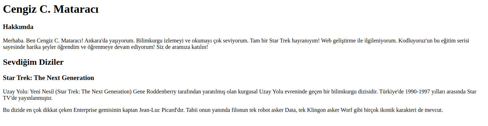

# Ödev

### -Siteyi açtığımızda adınız ve soyadınızı başlık şeklinde göstermeniz gerekiyor.
### -Ad-Soyadın altında alt başlık olarak Hakkımda yazmalıdır.
### -Altına paragraf içerisinde neler yaptığınızı ve nelerden hoşlandığınızı yazabilirsiniz.
### -Web sitenizi kaydederken dosya adı olarak 'index.html' seçmeniz gerekmektedir.
### -Yazdığınız kodları açıklayan yorum satırları eklemeyi unutmayın.

<h1>ÖRNEK

